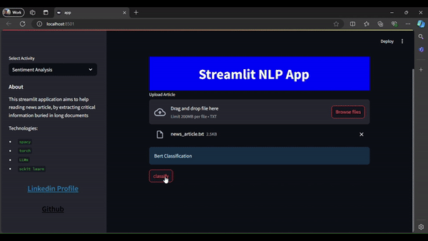

# Sentiment Analysis and Interactive Visualization of Financial News
In this project, I developed an interactive scatter plot that visualizes sentiment in financial news articles. 
The scatter plot classifies news sentiment into three categories: positive, neutral, and negative, while also 
displaying the intensity of each sentiment class. This provides users with a clear and intuitive way to 
understand the sentiment distribution in financial news.
### Modeling Approach
I implemented two distinct approaches for sentiment classification:
1. BERT-Based Model:
In the first approach, I used Google's BERT model for tokenization and word embeddings, 
followed by a custom linear layer for classification. This model achieved higher accuracy due to 
the powerful contextual understanding provided by BERT, making it well-suited for handling 
complex financial text.
2. LSTM Model Without Pretrained Embeddings:
The second approach involved using an LSTM (Long Short-Term Memory) model without any 
pretrained embeddings. The results from this model were lower in accuracy compared to the 
BERT-based model, and there was also slight overfitting. To mitigate this overfitting, I suggest 
incorporating more training data or using pretrained embeddings such as GloVe, which could 
improve the model’s generalization.
### Dataset
For this project, I used the Financial Phrase Bank v1.0 dataset, which contains a collection of 4,840 
sentences. These sentences have been annotated for sentiment by 16 individuals with significant 
background knowledge in financial markets. Specifically, I worked with the subset of sentences that had 
more than 75% agreement among annotators, ensuring high-quality sentiment labels (file: 
Sentences_75Agree.txt).
### Regression for Sentiment Intensity and Production Simulation
I also developed a regression model to predict the intensity of each sentiment class. This model is available 
in the regression notebook, where I used Databricks to train the models. However, due to the limitations 
of my free Databricks subscription (which restricts long training sessions), I utilized my own resources—a 
server with multiple GPUs—for training other models.
In addition, I created a production example notebook to simulate the deployment of this approach in a 
production environment. In this setup, I used the yfinance API to retrieve news articles and apply my 
sentiment classification models to the live data.
### Demonstration and Future Deployment
As a demonstration, I developed a Streamlit app to showcase how my approach works. 

